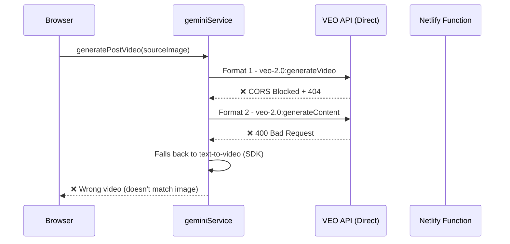

# STORY-012: VEO Image-to-Video Fix Analysis

## Problem Statement
When generating videos for social media posts, the text-to-video fallback produces videos that are **completely different** from the source image on the card. This wastes API credits and creates poor user experience.

**User Requirement:** The video MUST animate the EXACT image shown on the card (image-to-video), not create a random video from text description.

---

## Root Cause Analysis

### Current Code Flow (Broken)



### Issues Identified

| Issue | Root Cause | Impact |
|-------|------------|--------|
| **CORS Blocked** | Browser making direct calls to `generativelanguage.googleapis.com` | Request fails |
| **404 Not Found** | `veo-2.0-generate-001:generateVideo` endpoint doesn't exist on AI Studio API | Format 1 fails |
| **400 Bad Request** | `responseModalities: ["VIDEO"]` not valid for Gemini-style API | Format 2 fails |
| **Wrong Video** | Text-to-video fallback creates video from prompt, not source image | UX broken, credits wasted |

### API Confusion
There are **TWO different Google APIs** for VEO:

1. **AI Studio API** (`generativelanguage.googleapis.com`)
   - Uses API key authentication
   - Limited VEO support
   - `generateVideos` method works for TEXT-to-video only
   - Image-to-video format is unclear/unsupported

2. **Vertex AI API** (`aiplatform.googleapis.com`)
   - Uses service account + OAuth
   - Full VEO 2/3 support including image-to-video
   - Different request format (instances/parameters)
   - Requires GCP project setup

**Current code tries AI Studio format on AI Studio API but uses Vertex AI formats - they're incompatible!**

---

## Research Findings

### How Production Apps Solve This

Based on research, successful VEO image-to-video implementations use:

1. **Server-side proxy** (mandatory for CORS)
2. **Vertex AI API** (not AI Studio API) for image-to-video
3. **Service account authentication** (not API key)
4. **Correct request format** for Vertex AI

### Vertex AI Image-to-Video Format (Correct)

```json
POST https://us-central1-aiplatform.googleapis.com/v1/projects/{PROJECT_ID}/locations/us-central1/publishers/google/models/veo-003:predictLongRunning

{
  "instances": [{
    "prompt": "Gentle camera zoom with subtle motion",
    "image": {
      "bytesBase64Encoded": "base64_image_data",
      "mimeType": "image/png"
    }
  }],
  "parameters": {
    "aspectRatio": "9:16",
    "sampleCount": 1,
    "durationSeconds": 5
  }
}
```

### AI Studio Limitation
The AI Studio API (`generativelanguage.googleapis.com`) with API key:
- ✅ Supports text-to-video via SDK `client.models.generateVideos()`
- ❌ Does NOT clearly support image-to-video with the formats we're trying
- ❌ The `generateContent` endpoint with `responseModalities: ["VIDEO"]` is rejected

---

## Solution Options

### Option A: Switch to Vertex AI (Recommended)

**Pros:**
- Full image-to-video support
- Production-grade API
- Used by professional AI video apps

**Cons:**
- Requires GCP project setup
- Service account authentication (not API key)
- More complex deployment

**Implementation:**
1. Create GCP project
2. Enable Vertex AI API
3. Create service account with Vertex AI User role
4. Store service account key securely in Netlify env vars
5. Update Netlify function to use Vertex AI endpoint
6. Use OAuth2 to generate access token from service account

### Option B: Use Third-Party VEO Wrapper API

Services like `veo3gen.co` or `veo3api.ai` provide:
- Simple REST API with API key
- Built-in CORS handling
- Image-to-video support

**Pros:**
- Simple integration
- No GCP setup needed

**Cons:**
- Additional cost (pay per video)
- Dependency on third party
- May have different rate limits

### Option C: Use Google AI SDK with Correct Approach

The Google GenAI SDK `client.models.generateVideos()` may support image input if formatted correctly.

**Research needed:** Check if `@google/genai` SDK supports passing an image to `generateVideos()`.

---

## Recommended Solution: Option A (Vertex AI)

### Why Vertex AI?
1. Official Google API for production VEO usage
2. Proper image-to-video support
3. Same quota/pricing as current setup
4. Already have Netlify function infrastructure

### Implementation Plan

#### Phase 1: GCP Setup
1. Create or use existing GCP project
2. Enable Vertex AI API
3. Create service account
4. Generate JSON key

#### Phase 2: Netlify Function Update
Update `/netlify/functions/generate-video.ts`:

```typescript
import { GoogleAuth } from 'google-auth-library';

// Get access token from service account
const auth = new GoogleAuth({
  credentials: JSON.parse(process.env.GOOGLE_SERVICE_ACCOUNT_KEY!),
  scopes: ['https://www.googleapis.com/auth/cloud-platform'],
});
const accessToken = await auth.getAccessToken();

// Vertex AI endpoint
const endpoint = `https://us-central1-aiplatform.googleapis.com/v1/projects/${projectId}/locations/us-central1/publishers/google/models/veo-003:predictLongRunning`;

const response = await fetch(endpoint, {
  method: 'POST',
  headers: {
    'Authorization': `Bearer ${accessToken}`,
    'Content-Type': 'application/json',
  },
  body: JSON.stringify({
    instances: [{
      prompt: motionPrompt,
      image: {
        bytesBase64Encoded: imageBase64,
        mimeType: mimeType,
      },
    }],
    parameters: {
      aspectRatio: "9:16",
      sampleCount: 1,
      durationSeconds: 5,
    },
  }),
});
```

#### Phase 3: Frontend Update
Update `geminiService.ts` to:
1. **ALWAYS** route image-to-video through Netlify function
2. **REMOVE** direct API call attempts for image-to-video
3. Keep text-to-video SDK as fallback ONLY when no source image

### Environment Variables Needed
```
GOOGLE_CLOUD_PROJECT_ID=your-project-id
GOOGLE_SERVICE_ACCOUNT_KEY={"type":"service_account","project_id":...}
```

---

## Risks and Mitigations

| Risk | Mitigation |
|------|------------|
| GCP project costs | Use existing GCP project if available; Vertex AI charges same as AI Studio |
| Service account security | Store key in Netlify env vars (encrypted) |
| Quota limits | Same as current API key quota |
| Development time | ~2-4 hours for full implementation |

---

## Decision Required

Before implementation, confirm:

1. **Do you have a GCP project?** If not, one needs to be created.
2. **Is Option A (Vertex AI) acceptable?** Or prefer Option B (third-party)?
3. **Budget for potential GCP costs?** (Likely $0 with free tier for testing)

---

## Files to Modify

1. `/netlify/functions/generate-video.ts` - Vertex AI integration
2. `/services/geminiService.ts` - Remove direct VEO calls, always use Netlify function
3. `.env` / Netlify env vars - Add GCP credentials

---

## Success Criteria

After implementation:
- ✅ Video animates the EXACT source image shown on card
- ✅ No CORS errors in console
- ✅ No 404/400 API errors
- ✅ No "falling back to text-to-video" warnings
- ✅ Consistent visual match between image and first video frame

