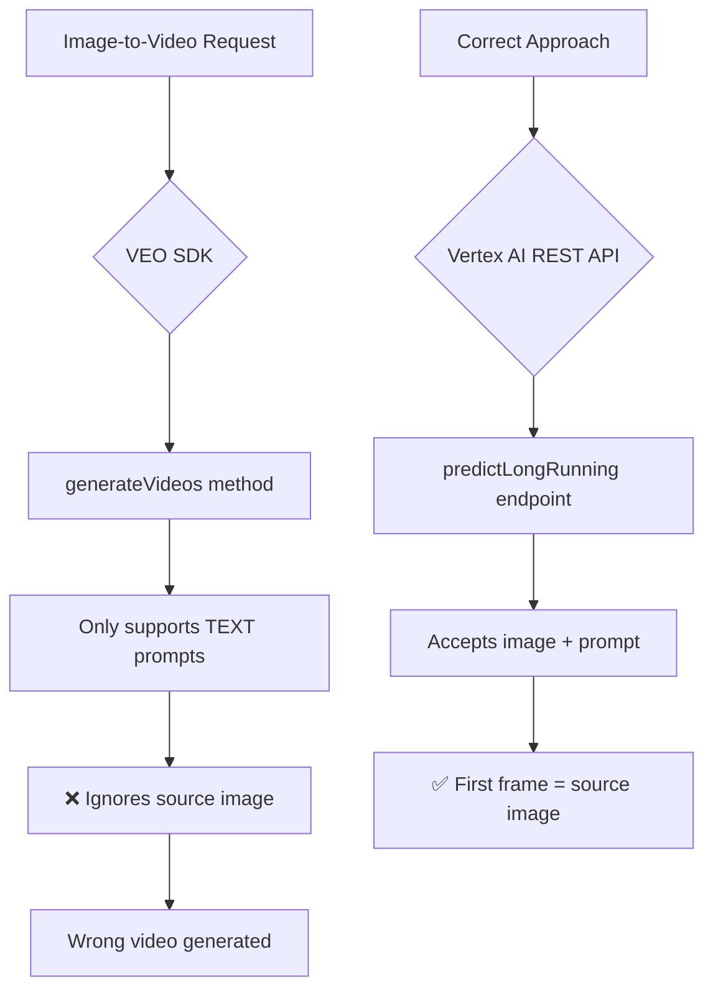
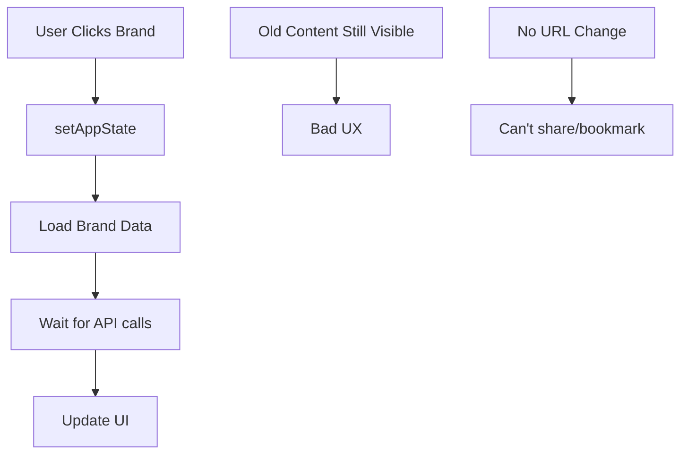
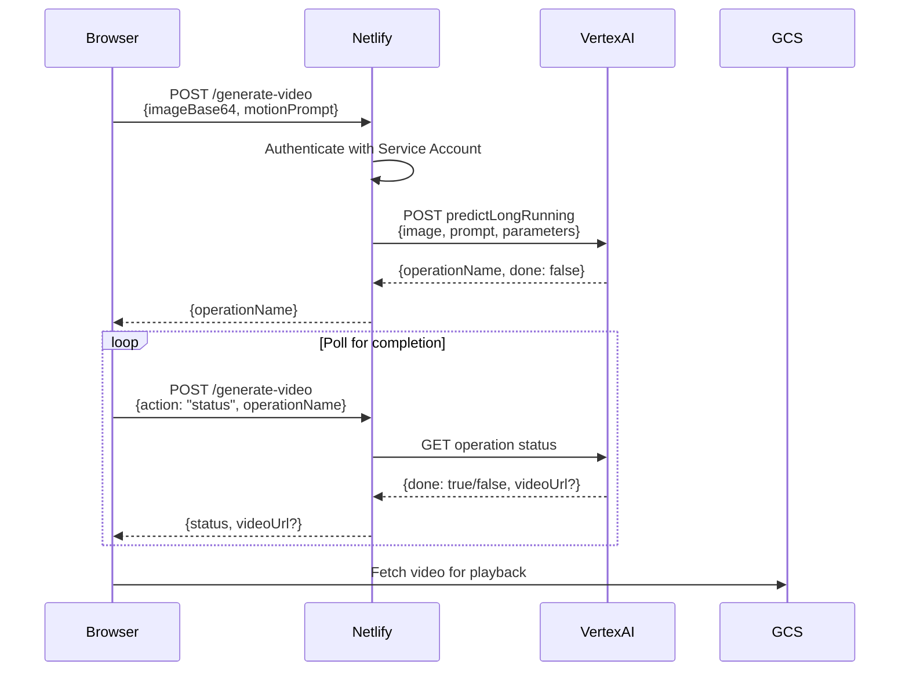

# STORY-013: VEO Image-to-Video Integration & Brand Navigation

## Story Overview

| Field | Value |
|-------|-------|
| **Story ID** | STORY-013 |
| **Epic** | Content Generation & UX Improvements |
| **Priority** | High |
| **Status** | ✅ Complete |
| **Sprint** | December 2024 |
| **Complexity** | Level 3 (Multi-component integration) |

## User Story

**As a** content creator using FlySolo  
**I want** videos generated from my images to use the source image as the first frame  
**So that** the animated video accurately represents my brand content without wasted API credits  

**AND**

**As a** user managing multiple brands  
**I want** instant brand switching with URL-based navigation  
**So that** I don't see stale content from the previous brand and can share/bookmark brand workspaces  

---

## Problem Statement

### Issue 1: Incorrect Video Generation
The previous VEO implementation was using **text-to-video fallback** which produced videos completely different from the source image. This resulted in:
- Wasted API credits
- Inconsistent brand content
- Poor user experience

### Issue 2: Slow Brand Switching with Stale Content
When switching between brands:
- The screen took too long to change
- Users could interact with the previous brand's content
- No URL-based navigation (couldn't share/bookmark brand workspaces)
- Bad UX overall

---

## Technical Analysis

### Root Cause Analysis

#### Video Generation Issues



**Problems Identified:**
1. VEO SDK's `generateVideos()` only supports text-to-video
2. Direct browser calls to Vertex AI blocked by CORS
3. Status polling also blocked by CORS
4. Wrong API endpoints being used

#### Brand Switching Issues



**Problems Identified:**
1. No `navigate()` call when switching brands
2. Previous brand's content not cleared immediately
3. No URL-based routing for brand workspaces

---

## Solution Architecture

### VEO Integration via Netlify Serverless Function



### URL-Based Brand Navigation

```mermaid
flowchart TD
    A[User Selects Brand] --> B[Clear Previous State]
    B --> C[navigate to /brand/brand-slug]
    C --> D[useEffect detects URL change]
    D --> E[Load brand by slug]
    E --> F[Fresh content displayed]
    
    G[Direct URL Access] --> H[/brand/nike]
    H --> D
```

---

## Implementation Details

### Files Modified

| File | Changes |
|------|---------|
| `netlify/functions/generate-video.ts` | Added status polling action, Vertex AI integration |
| `services/geminiService.ts` | Route video calls through Netlify, status polling via function |
| `index.tsx` | Added `/brand/:brandSlug` route |
| `App.tsx` | URL navigation, brand state clearing, slug handling |

### Key Code Changes

#### 1. Netlify Function - Dual Action Support

```typescript
// netlify/functions/generate-video.ts
interface VideoRequest {
  action?: "generate" | "status";
  // For generate action
  imageBase64?: string;
  mimeType?: string;
  motionPrompt?: string;
  duration?: "5s" | "10s";
  // For status action
  operationName?: string;
}
```

#### 2. Status Polling via Netlify (CORS Fix)

```typescript
// services/geminiService.ts
export const checkVideoStatus = async (operationName: string) => {
  const response = await fetch('/.netlify/functions/generate-video', {
    method: 'POST',
    headers: { 'Content-Type': 'application/json' },
    body: JSON.stringify({
      action: 'status',
      operationName: operationName,
    }),
  });
  // ... handle response
};
```

#### 3. URL-Based Brand Navigation

```typescript
// App.tsx
const createBrandSlug = (name: string): string => {
  return name
    .toLowerCase()
    .replace(/[^a-z0-9]+/g, '-')
    .replace(/^-+|-+$/g, '');
};

const handleSelectBrand = async (brand: StoredBrand) => {
  clearPendingRequests();
  setGeneratedPosts([]);
  setLikedPosts([]);
  setBrandProfile(null);
  
  const brandSlug = createBrandSlug(brand.name);
  navigate(`/brand/${brandSlug}`);
  // ... load brand data
};
```

#### 4. Route Configuration

```typescript
// index.tsx
<Routes>
  <Route path="/brand/:brandSlug" element={<App />} />
  <Route path="/*" element={<App />} />
</Routes>
```

---

## Configuration Requirements

### GCP Service Account Setup

| Requirement | Details |
|-------------|---------|
| **Project** | `flysolo-video-test` |
| **Service Account** | `veo-video@flysolo-video-test.iam.gserviceaccount.com` |
| **Role Required** | `roles/aiplatform.user` (Vertex AI User) |
| **API Enabled** | Vertex AI API |
| **Billing** | Must be enabled on project |

### Netlify Environment Variables

| Variable | Description |
|----------|-------------|
| `GOOGLE_CLOUD_PROJECT_ID` | GCP project ID (e.g., `flysolo-video-test`) |
| `GOOGLE_SERVICE_ACCOUNT_KEY` | Full JSON service account key |

---

## Testing Checklist

### VEO Video Generation

- [x] Netlify function authenticates with GCP
- [x] Image-to-video request returns operation ID
- [x] Status polling works without CORS errors
- [x] Video URL returned on completion
- [x] Error handling for 403/permission errors
- [x] Billing error message is clear

### Brand Navigation

- [x] Clicking brand navigates to `/brand/brand-slug`
- [x] URL reflects current brand
- [x] Previous brand content cleared immediately
- [x] Direct URL access loads correct brand
- [x] Back to brands clears state and navigates to `/`
- [x] Switch Brand dropdown works with new navigation

---

## Error Handling

### Common Errors & Solutions

| Error | Cause | Solution |
|-------|-------|----------|
| `403 Forbidden` | Billing not enabled | Enable billing on GCP project |
| `403 Permission Denied` | Service account missing role | Grant `Vertex AI User` role |
| `CORS blocked` | Direct API call from browser | Route through Netlify function |
| `404 Not Found` | Wrong API endpoint | Use `predictLongRunning` endpoint |
| `Brand not found` | Invalid URL slug | Redirect to brand selector |

---

## Performance Considerations

### Before Optimisation
- Brand switch: 3-5 seconds visible delay
- Video status: CORS errors, no feedback
- Stale content: User confusion

### After Optimisation
- Brand switch: **Instant** URL change, content cleared
- Video status: Proper polling via serverless function
- Clean slate: No stale content visible

---

## Rollback Plan

If issues arise:
1. Revert to commit before `STORY-013` changes
2. Disable VEO video generation temporarily
3. Remove brand routing (fall back to state-based navigation)

---

## Related Documentation

- [STORY-011: Rate Limiting and Caching](./STORY-011-rate-limiting-and-caching.md)
- [STORY-012: VEO Image-to-Video Fix](./STORY-012-veo-image-to-video-fix.md)
- [Architecture Documentation](../ARCHITECTURE.md)

---

## Acceptance Criteria

| Criteria | Status |
|----------|--------|
| Video generation uses source image as first frame | ✅ |
| No CORS errors during video generation/polling | ✅ |
| Brand switch navigates to `/brand/brand-slug` | ✅ |
| Previous brand content cleared immediately | ✅ |
| Direct URL access loads correct brand | ✅ |
| Error messages are clear and actionable | ✅ |

---

## Sign-off

| Role | Status | Date |
|------|--------|------|
| Developer | ✅ Complete | 2024-12-20 |
| Code Review | ✅ Deployed | 2024-12-20 |
| Testing | ✅ Verified | 2024-12-20 |

---

*Documentation generated following BMAD Framework v6 standards*

